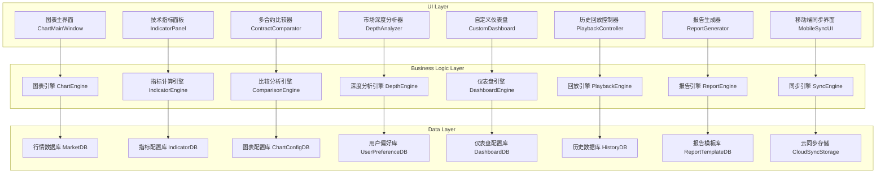

# 市场数据可视化与分析设计文档

## 概述

本设计文档详细描述了期货交易系统中市场数据可视化与分析模块的技术实现方案。该模块将基于现有的vnpy框架，集成专业的图表库和数据分析工具，为用户提供全面的市场数据可视化和分析能力。设计遵循模块化、可扩展和高性能的原则，确保与现有系统的无缝集成。

## 架构设计

### 整体架构图



### 核心设计原则

1. **模块化设计**: 各功能模块独立开发，通过标准接口通信
2. **数据与视图分离**: 采用MVVM模式，数据模型与视图逻辑分离
3. **实时性能优化**: 使用高效的数据结构和渲染技术
4. **可扩展性**: 提供插件机制支持自定义指标和图表工具
5. **跨平台兼容**: 支持桌面和移动端的一致体验

## 组件和接口设计

### 1. 高级K线图表系统 (ChartEngine)

#### 核心组件
```python
class ChartEngine(BaseEngine):
    """图表引擎"""
    
    def __init__(self, main_engine: MainEngine, event_engine: EventEngine):
        super().__init__(main_engine, event_engine, "ChartEngine")
        
        self.chart_manager = ChartManager()
        self.renderer = ChartRenderer()
        self.tool_manager = ChartToolManager()
        
    def create_chart(self, vt_symbol: str, chart_type: str, interval: str) -> str:
        """创建图表"""
        
    def update_chart(self, chart_id: str, data: BarData):
        """更新图表数据"""
        
    def add_drawing(self, chart_id: str, drawing_type: str, points: list, properties: dict) -> str:
        """添加图形标记"""
        
    def save_chart_config(self, chart_id: str) -> dict:
        """保存图表配置"""
        
    def load_chart_config(self, config: dict) -> str:
        """加载图表配置"""
```

#### 图表类型
```python
class ChartType(Enum):
    """图表类型"""
    CANDLE = "candle"  # K线图
    LINE = "line"      # 线图
    BAR = "bar"        # 柱状图
    AREA = "area"      # 面积图
    SCATTER = "scatter" # 散点图
    HEIKIN_ASHI = "heikin_ashi"  # 平均K线图
    RENKO = "renko"    # 砖形图
    KAGI = "kagi"      # 卡吉图
```

#### 绘图工具
```python
class DrawingTool:
    """绘图工具基类"""
    
    def __init__(self, chart_id: str, tool_id: str, properties: dict):
        self.chart_id = chart_id
        self.tool_id = tool_id
        self.properties = properties
        
    def draw(self, renderer):
        """绘制工具"""
        
    def hit_test(self, point: tuple) -> bool:
        """点击测试"""
        
    def serialize(self) -> dict:
        """序列化"""
        
    @classmethod
    def deserialize(cls, data: dict) -> "DrawingTool":
        """反序列化"""

# 具体绘图工具
class TrendLine(DrawingTool):
    """趋势线"""
    
class HorizontalLine(DrawingTool):
    """水平线"""
    
class FibonacciRetracement(DrawingTool):
    """斐波那契回调"""
    
class Rectangle(DrawingTool):
    """矩形"""
```

#### 图表渲染器
- **WebGL渲染**: 使用WebGL加速大数据量渲染
- **Canvas渲染**: 兼容性更好的Canvas 2D渲染
- **SVG渲染**: 适用于导出和打印的矢量渲染

### 2. 实时技术指标分析 (IndicatorEngine)

#### 核心组件
```python
class IndicatorEngine(BaseEngine):
    """指标计算引擎"""
    
    def __init__(self, main_engine: MainEngine, event_engine: EventEngine):
        super().__init__(main_engine, event_engine, "IndicatorEngine")
        
        self.indicator_registry = IndicatorRegistry()
        self.calculator = IndicatorCalculator()
        self.formula_parser = FormulaParser()
        
    def calculate_indicator(self, indicator_name: str, data: list, params: dict) -> list:
        """计算指标"""
        
    def register_custom_indicator(self, name: str, formula: str) -> bool:
        """注册自定义指标"""
        
    def get_indicator_signals(self, indicator_name: str, data: list, params: dict) -> list:
        """获取指标信号"""
        
    def save_indicator_template(self, template_name: str, indicators: list) -> bool:
        """保存指标模板"""
```

#### 内置指标库
```python
class IndicatorLibrary:
    """技术指标库"""
    
    @staticmethod
    def ma(data: list, period: int, price_key: str = "close") -> list:
        """移动平均线"""
        
    @staticmethod
    def ema(data: list, period: int, price_key: str = "close") -> list:
        """指数移动平均线"""
        
    @staticmethod
    def macd(data: list, fast_period: int, slow_period: int, signal_period: int) -> tuple:
        """MACD指标"""
        
    @staticmethod
    def rsi(data: list, period: int) -> list:
        """相对强弱指标"""
        
    @staticmethod
    def bollinger_bands(data: list, period: int, dev_up: float, dev_down: float) -> tuple:
        """布林带"""
        
    @staticmethod
    def atr(data: list, period: int) -> list:
        """平均真实波幅"""
```

#### 自定义指标编辑器
- **公式编辑**: 支持指标公式编辑和语法高亮
- **参数设置**: 自定义指标参数和默认值
- **可视化预览**: 实时预览指标计算结果
- **指标验证**: 公式语法和逻辑验证

### 3. 多合约对比分析 (ComparisonEngine)

#### 核心组件
```python
class ComparisonEngine(BaseEngine):
    """比较分析引擎"""
    
    def __init__(self, main_engine: MainEngine, event_engine: EventEngine):
        super().__init__(main_engine, event_engine, "ComparisonEngine")
        
        self.correlation_calculator = CorrelationCalculator()
        self.spread_analyzer = SpreadAnalyzer()
        self.arbitrage_scanner = ArbitrageScanner()
        
    def calculate_correlation(self, symbols: list, period: str, method: str) -> pd.DataFrame:
        """计算相关性"""
        
    def analyze_spread(self, symbol1: str, symbol2: str, ratio: float = 1.0) -> dict:
        """分析价差"""
        
    def scan_arbitrage_opportunity(self, symbol_pairs: list, threshold: float) -> list:
        """扫描套利机会"""
        
    def create_comparison_chart(self, symbols: list, normalize: bool = True) -> str:
        """创建比较图表"""
```

#### 相关性分析工具
- **相关系数矩阵**: 计算多合约间的相关系数
- **协整性检验**: 检验价格序列的协整关系
- **滚动相关性**: 计算动态变化的相关性
- **热力图可视化**: 直观展示相关性强度

### 4. 市场深度与成交量分析 (DepthEngine)

#### 核心组件
```python
class DepthEngine(BaseEngine):
    """深度分析引擎"""
    
    def __init__(self, main_engine: MainEngine, event_engine: EventEngine):
        super().__init__(main_engine, event_engine, "DepthEngine")
        
        self.depth_analyzer = MarketDepthAnalyzer()
        self.volume_analyzer = VolumeAnalyzer()
        self.order_flow_analyzer = OrderFlowAnalyzer()
        
    def analyze_market_depth(self, tick: TickData) -> dict:
        """分析市场深度"""
        
    def calculate_vwap(self, trades: list) -> float:
        """计算成交量加权平均价格"""
        
    def detect_large_orders(self, trades: list, threshold: float) -> list:
        """检测大单"""
        
    def calculate_liquidity_metrics(self, depth: dict) -> dict:
        """计算流动性指标"""
```

#### 深度图表类型
- **深度热图**: 显示不同价格层次的委托量热力图
- **成交量分布图**: 分析成交量在价格区间的分布
- **买卖盘口比例图**: 可视化买卖盘口的力量对比
- **大单跟踪图**: 标记并跟踪大额成交的价格影响

### 5. 自定义仪表盘与监控器 (DashboardEngine)

#### 核心组件
```python
class DashboardEngine(BaseEngine):
    """仪表盘引擎"""
    
    def __init__(self, main_engine: MainEngine, event_engine: EventEngine):
        super().__init__(main_engine, event_engine, "DashboardEngine")
        
        self.dashboard_manager = DashboardManager()
        self.widget_registry = WidgetRegistry()
        self.alert_manager = AlertManager()
        
    def create_dashboard(self, name: str, layout: dict) -> str:
        """创建仪表盘"""
        
    def add_widget(self, dashboard_id: str, widget_type: str, config: dict) -> str:
        """添加组件"""
        
    def set_alert(self, widget_id: str, condition: dict, action: dict) -> str:
        """设置警报"""
        
    def save_dashboard(self, dashboard_id: str) -> dict:
        """保存仪表盘配置"""
        
    def load_dashboard(self, config: dict) -> str:
        """加载仪表盘配置"""
```

#### 仪表盘组件类型
```python
class WidgetType(Enum):
    """组件类型"""
    CHART = "chart"          # 图表组件
    PRICE_TABLE = "price"    # 价格表格
    INDICATOR = "indicator"  # 指标组件
    DEPTH = "depth"          # 深度组件
    NEWS = "news"            # 新闻组件
    ALERT = "alert"          # 警报组件
    POSITION = "position"    # 持仓组件
    CUSTOM = "custom"        # 自定义组件
```

#### 警报系统
- **条件警报**: 基于价格、指标或其他条件的警报
- **视觉提醒**: 颜色变化、闪烁等视觉提示
- **声音提醒**: 可自定义的声音提示
- **消息推送**: 集成到消息通知系统

### 6. 历史数据回放与分析 (PlaybackEngine)

#### 核心组件
```python
class PlaybackEngine(BaseEngine):
    """回放引擎"""
    
    def __init__(self, main_engine: MainEngine, event_engine: EventEngine):
        super().__init__(main_engine, event_engine, "PlaybackEngine")
        
        self.data_loader = HistoryDataLoader()
        self.playback_controller = PlaybackController()
        self.event_marker = EventMarker()
        
    def load_history_data(self, vt_symbol: str, start_date: str, end_date: str, interval: str) -> bool:
        """加载历史数据"""
        
    def start_playback(self, speed: float = 1.0):
        """开始回放"""
        
    def pause_playback(self):
        """暂停回放"""
        
    def mark_event(self, timestamp: str, event_type: str, description: str) -> str:
        """标记事件"""
        
    def export_playback_data(self, format: str) -> str:
        """导出回放数据"""
```

#### 回放控制功能
- **速度控制**: 可调节的回放速度
- **暂停/继续**: 随时暂停和继续回放
- **跳转功能**: 跳转到特定时间点
- **循环回放**: 设置回放循环区间
- **事件标记**: 在时间轴上标记重要事件

### 7. 数据导出与报告生成 (ReportEngine)

#### 核心组件
```python
class ReportEngine(BaseEngine):
    """报告引擎"""
    
    def __init__(self, main_engine: MainEngine, event_engine: EventEngine):
        super().__init__(main_engine, event_engine, "ReportEngine")
        
        self.chart_exporter = ChartExporter()
        self.data_exporter = DataExporter()
        self.report_generator = ReportGenerator()
        self.template_manager = TemplateManager()
        
    def export_chart(self, chart_id: str, format: str, options: dict) -> str:
        """导出图表"""
        
    def export_data(self, data: list, format: str) -> str:
        """导出数据"""
        
    def generate_report(self, template_id: str, data: dict) -> str:
        """生成报告"""
        
    def schedule_report(self, template_id: str, schedule: dict) -> str:
        """设置定期报告"""
        
    def save_template(self, name: str, content: dict) -> str:
        """保存报告模板"""
```

#### 导出格式支持
- **图表格式**: PNG、JPG、SVG、PDF
- **数据格式**: CSV、Excel、JSON
- **报告格式**: PDF、HTML、Word

#### 报告模板系统
- **模板编辑器**: 可视化模板设计
- **变量替换**: 支持动态数据变量
- **章节管理**: 模块化报告章节
- **样式定制**: 自定义报告样式和品牌

### 8. 移动端图表同步 (SyncEngine)

#### 核心组件
```python
class SyncEngine(BaseEngine):
    """同步引擎"""
    
    def __init__(self, main_engine: MainEngine, event_engine: EventEngine):
        super().__init__(main_engine, event_engine, "SyncEngine")
        
        self.sync_manager = SyncManager()
        self.device_manager = DeviceManager()
        self.offline_cache = OfflineCache()
        
    def sync_chart_config(self, user_id: str, chart_id: str) -> bool:
        """同步图表配置"""
        
    def sync_dashboard_config(self, user_id: str, dashboard_id: str) -> bool:
        """同步仪表盘配置"""
        
    def register_device(self, user_id: str, device_info: dict) -> str:
        """注册设备"""
        
    def get_sync_status(self, user_id: str) -> dict:
        """获取同步状态"""
        
    def enable_offline_mode(self, device_id: str, data_types: list) -> bool:
        """启用离线模式"""
```

#### 同步机制
- **增量同步**: 只同步变更的配置
- **冲突解决**: 自动解决配置冲突
- **版本控制**: 配置的版本历史管理
- **选择性同步**: 用户可选择同步内容

## 数据模型设计

### 图表配置模型
```python
@dataclass
class ChartConfig:
    chart_id: str
    vt_symbol: str
    chart_type: str
    interval: str
    indicators: list
    drawings: list
    styles: dict
    created_time: datetime
    updated_time: datetime
```

### 指标配置模型
```python
@dataclass
class IndicatorConfig:
    indicator_id: str
    name: str
    formula: str
    params: dict
    styles: dict
    is_custom: bool
    created_by: str
```

### 仪表盘配置模型
```python
@dataclass
class DashboardConfig:
    dashboard_id: str
    name: str
    layout: dict
    widgets: list
    alerts: list
    created_time: datetime
    updated_time: datetime
```

## 技术实现方案

### 图表渲染技术
1. **主要图表库**: 使用TradingView Lightweight Charts或ECharts
2. **WebGL加速**: 大数据量时启用WebGL渲染
3. **数据降采样**: 智能降采样减少渲染压力
4. **增量更新**: 只更新变化的数据点

### 数据处理优化
1. **时间序列索引**: 优化时间序列数据查询
2. **数据缓存**: 多级缓存减少重复计算
3. **延迟加载**: 按需加载历史数据
4. **并行计算**: 多线程计算技术指标

### 跨平台实现
1. **响应式设计**: 适应不同屏幕尺寸
2. **WebSocket通信**: 实时数据同步
3. **本地存储**: IndexedDB/SQLite存储离线数据
4. **云同步**: 使用云服务同步用户配置

## 接口集成

### 与主系统集成
```python
# 在主引擎中注册图表引擎
main_engine.add_engine(ChartEngine)

# 订阅行情事件
event_engine.register(EVENT_TICK, chart_engine.process_tick)

# 集成到主界面
main_window.add_widget(chart_widget)
```

### 与数据源集成
```python
# 连接历史数据库
chart_engine.connect_history_database(database_config)

# 订阅实时数据
chart_engine.subscribe_realtime_data(vt_symbol)

# 数据格式转换
bar_data = chart_engine.convert_tick_to_bar(tick_data, interval)
```

## 性能优化策略

### 1. 图表渲染优化
```python
# 使用WebGL渲染大数据量
if data_points > 10000:
    renderer.use_webgl = True
    
# 智能降采样
sampled_data = chart_engine.downsample(data, visible_range, max_points=5000)

# 分层渲染
renderer.render_background()
renderer.render_grid()
renderer.render_data(sampled_data)
renderer.render_overlay()
```

### 2. 数据处理优化
```python
# 缓存计算结果
@lru_cache(maxsize=100)
def calculate_indicator(indicator_name, data_hash, **params):
    # 计算逻辑
    
# 增量更新
def update_indicator(indicator, new_data):
    if indicator.can_update_incrementally:
        return indicator.update(new_data)
    else:
        return indicator.recalculate(full_data)
```

### 3. 内存管理
```python
# 限制历史数据加载
def load_history_data(symbol, interval, limit=1000):
    # 加载逻辑
    
# 释放不活跃图表资源
def cleanup_inactive_charts():
    for chart_id, last_active in active_charts.items():
        if time.time() - last_active > 3600:  # 1小时未活动
            unload_chart_resources(chart_id)
```

## 测试策略

### 单元测试
- 指标计算准确性测试
- 图表工具功能测试
- 数据导出格式测试

### 集成测试
- 与主系统的事件通信测试
- 多模块协作测试
- 数据流端到端测试

### 性能测试
- 大数据量渲染性能测试
- 多图表同时显示测试
- 实时数据更新性能测试

### 用户体验测试
- 界面响应速度测试
- 操作流程顺畅度测试
- 移动端适配性测试

---

本设计文档提供了市场数据可视化与分析模块的完整技术方案，确保新功能与现有系统的无缝集成，同时保持系统的高性能和可扩展性。