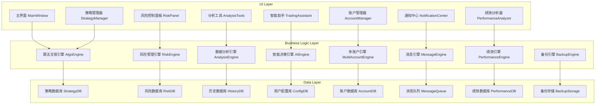

# 期货交易系统功能增强设计文档

## 概述

本设计文档基于现有的vnpy期货交易系统，提出了8个核心功能增强模块的详细技术设计方案。设计遵循vnpy的架构模式，采用事件驱动、模块化和可扩展的设计原则，确保新功能与现有系统的无缝集成。

## 架构设计

### 整体架构图



### 核心设计原则

1. **事件驱动架构**: 继承vnpy的EventEngine模式，所有模块通过事件通信
2. **模块化设计**: 每个功能模块独立开发，支持热插拔
3. **数据持久化**: 使用SQLite/MongoDB存储策略、配置和历史数据
4. **异步处理**: 采用多线程处理耗时操作，保持UI响应性
5. **可扩展性**: 预留接口支持第三方插件和自定义扩展

## 组件和接口设计

### 1. 算法交易策略引擎 (AlgoEngine)

#### 核心组件
```python
class AlgoEngine(BaseEngine):
    """算法交易引擎"""
    
    def __init__(self, main_engine: MainEngine, event_engine: EventEngine):
        super().__init__(main_engine, event_engine, "AlgoEngine")
        
        self.strategy_manager = StrategyManager()
        self.execution_engine = ExecutionEngine()
        self.signal_generator = SignalGenerator()
        
    def load_strategy(self, strategy_config: dict) -> str:
        """加载策略"""
        
    def start_strategy(self, strategy_name: str) -> bool:
        """启动策略"""
        
    def stop_strategy(self, strategy_name: str) -> bool:
        """停止策略"""
        
    def get_strategy_status(self, strategy_name: str) -> dict:
        """获取策略状态"""
```

#### 策略模板接口
```python
class AlgoStrategyTemplate:
    """算法策略模板基类"""
    
    def __init__(self, strategy_engine, strategy_name: str, vt_symbols: list, setting: dict):
        self.strategy_engine = strategy_engine
        self.strategy_name = strategy_name
        self.vt_symbols = vt_symbols
        self.setting = setting
        
    def on_init(self):
        """策略初始化"""
        
    def on_start(self):
        """策略启动"""
        
    def on_stop(self):
        """策略停止"""
        
    def on_tick(self, tick: TickData):
        """行情推送"""
        
    def on_bar(self, bar: BarData):
        """K线推送"""
        
    def send_order(self, direction: Direction, offset: Offset, price: float, volume: float):
        """发送委托"""
```

#### 内置策略类型
- **网格交易策略**: 在价格区间内进行高抛低吸
- **均线策略**: 基于移动平均线的趋势跟踪
- **套利策略**: 跨合约、跨市场套利
- **做市策略**: 提供流动性的双边报价
- **动量策略**: 基于价格动量的趋势交易

### 2. 高级风险管理系统 (RiskEngine)

#### 核心组件
```python
class RiskEngine(BaseEngine):
    """风险管理引擎"""
    
    def __init__(self, main_engine: MainEngine, event_engine: EventEngine):
        super().__init__(main_engine, event_engine, "RiskEngine")
        
        self.risk_monitor = RiskMonitor()
        self.position_manager = PositionManager()
        self.limit_checker = LimitChecker()
        
    def check_order_risk(self, order_req: OrderRequest) -> tuple[bool, str]:
        """订单风险检查"""
        
    def monitor_position_risk(self):
        """持仓风险监控"""
        
    def execute_risk_action(self, action_type: str, params: dict):
        """执行风险控制动作"""
```

#### 风险控制规则
```python
class RiskRule:
    """风险控制规则基类"""
    
    def __init__(self, rule_name: str, rule_config: dict):
        self.rule_name = rule_name
        self.rule_config = rule_config
        
    def check(self, context: dict) -> tuple[bool, str]:
        """风险检查"""
        
    def get_action(self) -> str:
        """获取风险动作"""

# 具体风险规则
class MaxPositionRule(RiskRule):
    """最大持仓规则"""
    
class MaxLossRule(RiskRule):
    """最大亏损规则"""
    
class PriceDeviationRule(RiskRule):
    """价格偏离规则"""
```

#### 风险指标计算
- **VaR计算**: 基于历史模拟和蒙特卡洛方法
- **最大回撤**: 实时计算策略和账户的最大回撤
- **夏普比率**: 风险调整后收益率指标
- **波动率**: 价格和收益的波动率分析

### 3. 多维度数据分析工具 (AnalysisEngine)

#### 核心组件
```python
class AnalysisEngine(BaseEngine):
    """数据分析引擎"""
    
    def __init__(self, main_engine: MainEngine, event_engine: EventEngine):
        super().__init__(main_engine, event_engine, "AnalysisEngine")
        
        self.technical_analyzer = TechnicalAnalyzer()
        self.statistical_analyzer = StatisticalAnalyzer()
        self.backtester = BacktestEngine()
        
    def calculate_indicator(self, symbol: str, indicator: str, params: dict) -> list:
        """计算技术指标"""
        
    def run_backtest(self, strategy_config: dict, start_date: str, end_date: str) -> dict:
        """运行回测"""
        
    def generate_report(self, analysis_type: str, params: dict) -> dict:
        """生成分析报告"""
```

#### 技术指标库
```python
class TechnicalIndicators:
    """技术指标计算库"""
    
    @staticmethod
    def sma(data: list, period: int) -> list:
        """简单移动平均"""
        
    @staticmethod
    def ema(data: list, period: int) -> list:
        """指数移动平均"""
        
    @staticmethod
    def rsi(data: list, period: int) -> list:
        """相对强弱指标"""
        
    @staticmethod
    def macd(data: list, fast: int, slow: int, signal: int) -> tuple:
        """MACD指标"""
        
    @staticmethod
    def bollinger_bands(data: list, period: int, std_dev: float) -> tuple:
        """布林带"""
```

#### 回测框架
- **事件驱动回测**: 模拟真实交易环境
- **向量化回测**: 快速批量回测
- **多因子回测**: 支持多因子模型验证
- **组合回测**: 多策略组合回测

### 4. 智能交易助手 (AIEngine)

#### 核心组件
```python
class AIEngine(BaseEngine):
    """智能决策引擎"""
    
    def __init__(self, main_engine: MainEngine, event_engine: EventEngine):
        super().__init__(main_engine, event_engine, "AIEngine")
        
        self.pattern_recognizer = PatternRecognizer()
        self.sentiment_analyzer = SentimentAnalyzer()
        self.recommendation_engine = RecommendationEngine()
        
    def analyze_market_pattern(self, symbol: str) -> dict:
        """市场模式分析"""
        
    def generate_trading_signal(self, symbol: str) -> dict:
        """生成交易信号"""
        
    def provide_recommendation(self, context: dict) -> dict:
        """提供交易建议"""
```

#### 智能分析模块
- **价格模式识别**: 识别头肩顶、双底等经典形态
- **异常检测**: 检测价格和成交量异常
- **情绪分析**: 基于新闻和社交媒体的市场情绪
- **机器学习预测**: 使用ML模型预测价格走势

### 5. 多账户管理系统 (MultiAccountEngine)

#### 核心组件
```python
class MultiAccountEngine(BaseEngine):
    """多账户管理引擎"""
    
    def __init__(self, main_engine: MainEngine, event_engine: EventEngine):
        super().__init__(main_engine, event_engine, "MultiAccountEngine")
        
        self.account_manager = AccountManager()
        self.order_router = OrderRouter()
        self.position_aggregator = PositionAggregator()
        
    def add_account(self, account_config: dict) -> str:
        """添加账户"""
        
    def route_order(self, order_req: OrderRequest, routing_rule: str) -> list:
        """订单路由"""
        
    def get_aggregated_position(self) -> dict:
        """获取汇总持仓"""
```

#### 账户管理功能
- **账户配置**: 支持多个期货公司账户
- **资金分配**: 按比例或固定金额分配
- **风险隔离**: 账户间风险独立管理
- **统一监控**: 所有账户的统一监控界面

### 6. 实时消息通知系统 (MessageEngine)

#### 核心组件
```python
class MessageEngine(BaseEngine):
    """消息通知引擎"""
    
    def __init__(self, main_engine: MainEngine, event_engine: EventEngine):
        super().__init__(main_engine, event_engine, "MessageEngine")
        
        self.notification_manager = NotificationManager()
        self.message_queue = MessageQueue()
        self.delivery_service = DeliveryService()
        
    def send_notification(self, message: dict, channels: list):
        """发送通知"""
        
    def subscribe_event(self, event_type: str, condition: dict, action: dict):
        """订阅事件通知"""
        
    def get_message_history(self, start_time: str, end_time: str) -> list:
        """获取消息历史"""
```

#### 通知渠道
- **桌面通知**: 系统托盘弹窗通知
- **邮件通知**: SMTP邮件发送
- **短信通知**: 集成短信服务商API
- **微信通知**: 企业微信机器人推送
- **移动推送**: 支持iOS/Android推送

### 7. 交易绩效分析系统 (PerformanceEngine)

#### 核心组件
```python
class PerformanceEngine(BaseEngine):
    """绩效分析引擎"""
    
    def __init__(self, main_engine: MainEngine, event_engine: EventEngine):
        super().__init__(main_engine, event_engine, "PerformanceEngine")
        
        self.performance_calculator = PerformanceCalculator()
        self.report_generator = ReportGenerator()
        self.benchmark_manager = BenchmarkManager()
        
    def calculate_performance(self, account_id: str, start_date: str, end_date: str) -> dict:
        """计算绩效指标"""
        
    def generate_report(self, report_type: str, params: dict) -> str:
        """生成绩效报告"""
        
    def compare_benchmark(self, account_id: str, benchmark: str) -> dict:
        """基准比较"""
```

#### 绩效指标
- **收益率指标**: 总收益率、年化收益率、月度收益率
- **风险指标**: 最大回撤、波动率、VaR、夏普比率
- **交易指标**: 胜率、盈亏比、平均持仓时间
- **归因分析**: 收益来源分析、行业配置分析

### 8. 数据备份与恢复系统 (BackupEngine)

#### 核心组件
```python
class BackupEngine(BaseEngine):
    """备份恢复引擎"""
    
    def __init__(self, main_engine: MainEngine, event_engine: EventEngine):
        super().__init__(main_engine, event_engine, "BackupEngine")
        
        self.backup_manager = BackupManager()
        self.restore_manager = RestoreManager()
        self.scheduler = BackupScheduler()
        
    def create_backup(self, backup_type: str, target_path: str) -> str:
        """创建备份"""
        
    def restore_backup(self, backup_file: str, restore_options: dict) -> bool:
        """恢复备份"""
        
    def schedule_backup(self, schedule_config: dict):
        """设置备份计划"""
```

#### 备份策略
- **增量备份**: 只备份变更的数据
- **全量备份**: 完整的系统数据备份
- **实时备份**: 关键数据的实时同步
- **云端备份**: 支持云存储服务

## 数据模型设计

### 策略数据模型
```python
@dataclass
class StrategyData:
    strategy_name: str
    strategy_class: str
    vt_symbols: list
    setting: dict
    status: str
    created_time: datetime
    updated_time: datetime
```

### 风险数据模型
```python
@dataclass
class RiskData:
    account_id: str
    symbol: str
    position: float
    unrealized_pnl: float
    risk_level: str
    warning_message: str
    timestamp: datetime
```

### 绩效数据模型
```python
@dataclass
class PerformanceData:
    account_id: str
    date: str
    total_return: float
    daily_return: float
    max_drawdown: float
    sharpe_ratio: float
    win_rate: float
```

## 错误处理策略

### 异常分类
1. **网络异常**: 连接超时、断线重连
2. **数据异常**: 数据格式错误、缺失数据
3. **业务异常**: 风险控制、资金不足
4. **系统异常**: 内存不足、磁盘空间

### 错误恢复机制
- **自动重试**: 网络请求失败自动重试
- **降级服务**: 核心功能优先保障
- **故障转移**: 备用服务自动切换
- **数据恢复**: 从备份中恢复损坏数据

## 测试策略

### 单元测试
- 每个引擎的核心功能测试
- 数据模型的验证测试
- 算法和指标的准确性测试

### 集成测试
- 引擎间的协作测试
- 事件流的端到端测试
- 数据库操作的集成测试

### 性能测试
- 高频数据处理性能
- 并发用户访问测试
- 内存和CPU使用率监控

### 回归测试
- 新功能对现有功能的影响
- 数据迁移的完整性验证
- 用户界面的兼容性测试

---

本设计文档提供了期货交易系统功能增强的完整技术方案，确保新功能与现有系统的无缝集成，同时保持系统的稳定性和可扩展性。