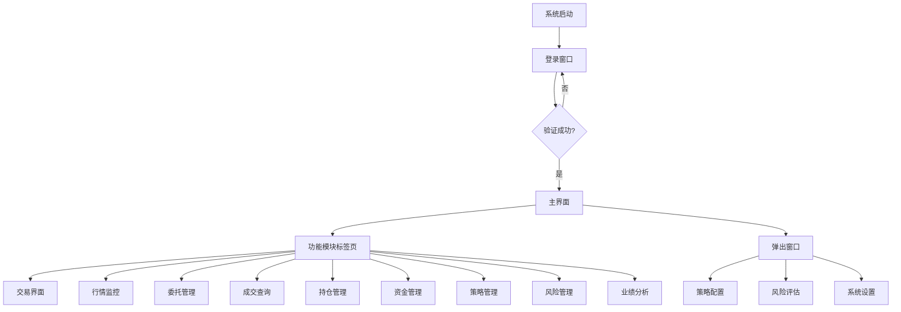

# 交易系统UI/UX设计方案
## vn.py风格完整界面架构与交互规范

### 📋 设计目标
- **一致性**: 完全遵循vn.py设计理念和交互模式
- **高效性**: 减少用户操作步骤，提高工作效率
- **清晰性**: 信息层级分明，视觉引导清晰
- **可扩展性**: 模块化设计，支持功能扩展

---

## 🏗️ 整体界面架构

### 界面层级结构图
```
交易系统 (Main Application)
├── 登录系统 (Login Flow)
│   ├── 登录窗口 (Login Dialog)
│   ├── 服务器配置 (Gateway Config)
│   └── 账户信息输入 (Account Input)
├── 主界面 (Main Window) - 三栏布局
│   ├── 顶部工具栏 (Top Toolbar)
│   ├── 左侧面板 (Left Panel) - 功能导航
│   ├── 中央工作区 (Center Workspace)
│   └── 底部状态栏 (Status Bar)
├── 功能模块窗口 (Functional Modules)
│   ├── 交易界面 (Trading Widget)
│   ├── 行情监控 (Market Monitor)
│   ├── 委托管理 (Order Manager)
│   ├── 成交查询 (Trade Monitor)
│   ├── 持仓管理 (Position Monitor)
│   ├── 资金管理 (Account Monitor)
│   ├── 日志查看 (Log Monitor)
│   ├── 策略管理 (Strategy Manager)
│   ├── 风险管理 (Risk Manager)
│   ├── 业绩分析 (Performance Analytics)
│   └── 通知中心 (Notification Center)
└── 配置界面 (Configuration Interfaces)
    ├── 系统设置 (Settings Dialog)
    ├── 策略配置 (Strategy Config)
    └── 个性化设置 (Preferences)
```

---

## 🚪 登录系统 (Login Flow)

### 登录窗口 (Login Dialog)
**界面布局**:
```
┌─────────────────────────────────────────┐
│  交易系统登录                              │
├─────────────────────────────────────────┤
│  [Logo]                                 │
│                                         │
│  服务器: [CTP服务器下拉框] ▼           │
│  账号:   [输入框]                       │
│  密码:   [密码输入框]                   │
│  产品名称: [输入框]                     │
│  授权编码: [输入框]                     │
│                                         │
│  [保存配置复选框] 记住密码               │
│                                         │
│  [连接按钮] [退出按钮]                   │
│                                         │
│  连接状态: [状态指示灯]                 │
└─────────────────────────────────────────┘
```

**交互逻辑**:
1. **自动填充**: 记住上次成功的登录配置
2. **实时验证**: 输入框失去焦点时验证格式
3. **连接动画**: 连接过程中显示加载动画
4. **错误提示**: 友好的错误信息提示
5. **记住密码**: 加密存储到本地配置文件

### 服务器配置 (Gateway Config)
**层级关系**: 登录窗口 → 服务器配置按钮 → 配置弹窗

**配置弹窗内容**:
```
┌─────────────────────────────────────────┐
│  服务器配置                               │
├─────────────────────────────────────────┤
│  交易服务器: [地址:端口]                │
│  行情服务器: [地址:端口]                │
│  经纪商编号: [输入框]                   │
│  产品信息认证:                           │
│  产品名称: [输入框]                     │
│  授权编码: [输入框]                     │
│                                         │
│  [测试连接按钮]                         │
│                                         │
│  [确认] [取消]                          │
└─────────────────────────────────────────┘
```

---

## 🏢 主界面布局 (Main Window)

### vn.py标准三栏布局

#### 顶部工具栏 (Top Toolbar)
```
┌─────────────────────────────────────────────────────────────────────────┐
│ [Logo] 交易系统 v2.0             [时间显示] [连接状态] [账户信息] [设置] │
├─────────────────────────────────────────────────────────────────────────┤
│ [交易] [行情] [委托] [成交] [持仓] [资金] [策略] [风险] [分析] [日志] │
└─────────────────────────────────────────────────────────────────────────┘
```

#### 左侧面板 (Left Panel) - 可折叠
```
┌───────────────────┐
│ 功能导航          │
├───────────────────┤
│ 📈 行情监控       │
│ 📋 委托管理       │
│ 💰 成交查询       │
│ 📊 持仓管理       │
│ 🏦 资金管理       │
│ ⚙️ 策略管理       │
│ 🛡️ 风险管理       │
│ 📊 业绩分析       │
│ 🔔 通知中心       │
│ 📥 日志查看       │
└───────────────────┘
```

#### 中央工作区 (Center Workspace)
**动态标签页布局**: 类似浏览器标签页

```
┌─────────────────────────────────────────────────────┐
│ 行情监控 | 委托管理 | 成交查询 | ×                    │
├─────────────────────────────────────────────────────┤
│                                                     │
│  [当前激活的功能界面内容]                           │
│                                                     │
└─────────────────────────────────────────────────────┘
```

#### 底部状态栏 (Status Bar)
```
┌─────────────────────────────────────────────────────────────────────────┐
│ 连接状态: [绿灯]已连接 | 账户: 123456 | 资金: ¥1,234,567.89 | 时间: 14:30:15 │
└─────────────────────────────────────────────────────────────────────────┘
```

---

## 📋 核心功能界面规范

### 1. 交易界面 (Trading Widget)
**位置**: 主界面默认显示

#### 布局结构
```
┌─────────────────────────────────────────┐
│ 合约选择区                              │
│ 合约代码: [RB2410] [搜索图标] 品种筛选   │
├─────────────────────────────────────────┤
│ 行情显示区                              │
│ 最新价: 3,500.00  涨跌: +15.00 (+0.43%) │
│ 买价: 3,499.00  买量: 120手              │
│ 卖价: 3,501.00  卖量: 85手               │
├─────────────────────────────────────────┤
│ 下单区域                                │
│ 方向: [多○] [空○]                       │
│ 价格: [3,500.00] [市价单○]              │
│ 手数: [  1  ] [+] [-]                   │
│ [买入开多] [卖出开空] [平仓] [撤单]       │
└─────────────────────────────────────────┘
```

### 2. 行情监控 (Market Monitor)
**布局**: vn.py标准表格样式

```
┌─────────────────────────────────────────────────────────┐
│ 合约代码 | 最新价 | 涨跌额 | 涨跌幅 | 成交量 | 持仓量 | 买卖价差 │
├─────────────────────────────────────────────────────────┤
│ RB2410  | 3500.0 | +15.0 | +0.43% | 12,345 | 45,678 | 2.0      │
│ I2409   |  800.5 |  -5.0 | -0.62% |  8,765 | 98,765 | 1.5      │
└─────────────────────────────────────────────────────────┘
```

### 3. 委托管理 (Order Manager)
**状态分类显示**:
- 待成交 (蓝色标签)
- 部分成交 (黄色标签)
- 全部成交 (绿色标签)
- 已撤单 (灰色标签)

### 4. 策略管理 (Strategy Manager)
**vn.py标准布局**:
```
┌─────────────────────────────────────────┐
│ 策略列表 | 配置面板 | 日志输出             │
├─────────────────────────────────────────┤
│ [策略名称] [状态] [配置] [启动] [停止]   │
│ 均线策略   运行中   配置   [停止]         │
│ MACD策略   已停止   配置   [启动]         │
└─────────────────────────────────────────┘
```

---

## 🎯 交互逻辑规范

### 导航模式
1. **主界面导航**: 顶部工具栏 + 左侧面板双重导航
2. **标签页切换**: 类似浏览器的中键关闭、右键菜单
3. **快捷键支持**: Ctrl+数字快速切换功能模块

### 数据加载策略
1. **懒加载**: 非活跃标签页数据延迟加载
2. **增量更新**: 只更新变化的数据行
3. **本地缓存**: 历史数据本地缓存，减少网络请求

### 错误处理
1. **友好提示**: 红色气泡提示错误信息
2. **重试机制**: 网络错误自动重连按钮
3. **日志记录**: 所有操作记录在本地日志中

---

## 🎨 视觉设计规范

### 颜色体系
**主色调**:
- 主色: #1890ff (vn.blue) - 操作按钮、高亮元素
- 成功: #52c41a - 盈利、成功状态
- 警告: #faad14 - 风险提醒
- 错误: #f5222d - 错误信息

**背景色**:
- 主背景: #f5f5f5 (浅灰)
- 卡片背景: #ffffff (纯白)
- 边框颜色: #d9d9d9 (浅灰边框)

### 字体规范
- 主字体: Microsoft YaHei UI
- 标题: 14px 加粗
- 正文: 12px 常规
- 小字号: 10px 辅助信息

### 间距规范
- 组件间距: 8px
- 内边距: 12px
- 外边距: 16px

---

## 🔄 状态管理

### 连接状态指示器
```
🟢 已连接 - 绿色图标，闪烁表示心跳正常
🟡 连接中 - 黄色旋转动画
🔴 已断开 - 红色图标，显示重连按钮
```

### 账户状态显示
```
正常状态: 账户信息显示正常
风险预警: 黄色背景提示风险级别
强制平仓: 红色背景闪烁警告
```

### 数据更新状态
```
实时数据: 绿色进度条慢慢填充
历史数据: 蓝色加载动画
离线模式: 灰色状态指示
```

---

## 📱 响应式设计

### 窗口缩放规则
- **最小窗口**: 1024x768
- **推荐窗口**: 1920x1080
- **最大窗口**: 支持4K分辨率

### 组件自适应
- 表格列宽自动调整
- 图表大小随窗口缩放
- 字体大小相对缩放

---

## 🎮 快捷键规范

### 全局快捷键
```
Ctrl+T          新建交易标签页
Ctrl+W          关闭当前标签页  
Ctrl+Tab        切换到下一个标签页
Ctrl+Shift+Tab  切换到上一个标签页
F1-F12          快速切换到对应功能模块
Ctrl+R          刷新当前页面数据
Ctrl+E          导出当前页面数据
```

### 交易快捷键
```
Ctrl+B          买入开多
Ctrl+S          卖出开空  
Ctrl+C          平仓操作
Ctrl+X          撤单操作
Space           快速下单确认
Esc             取消当前操作
```

---

## 🧪 用户操作流程示例

### 典型交易流程
1. **登录** → 双击桌面图标 → 输入账户信息 → 点击连接
2. **查看行情** → 点击左侧面板"行情监控" → 查看实时价格
3. **下单交易** → 在交易界面选择合约 → 设置交易参数 → 确认下单
4. **查看持仓** → 点击"持仓管理" → 查看当前持仓情况
5. **业绩分析** → 点击"业绩分析" → 查看交易统计图表

### 策略管理流程
1. **策略配置** → 点击"策略管理" → 选择策略模板
2. **参数设置** → 配置策略参数 → 设置风险控制
3. **策略启动** → 点击启动按钮 → 监控运行状态
4. **策略停止** → 点击停止按钮 → 查看运行日志

---

## 📊 界面关系图



---

## 🚀 开发优先级

### Phase 1: 基础界面 (高优先级)
- [ ] 登录窗口重构
- [ ] 主界面三栏布局实现
- [ ] 顶部工具栏统一样式

### Phase 2: 核心模块 (高优先级)  
- [ ] 交易界面标准化
- [ ] 行情监控表格重构
- [ ] 委托管理状态显示优化

### Phase 3: 高级功能 (中优先级)
- [ ] 策略管理界面重构
- [ ] 业绩分析图表优化
- [ ] 通知中心弹窗样式

### Phase 4: 交互优化 (低优先级)
- [ ] 快捷键系统实现
- [ ] 拖拽功能增强
- [ ] 主题切换功能